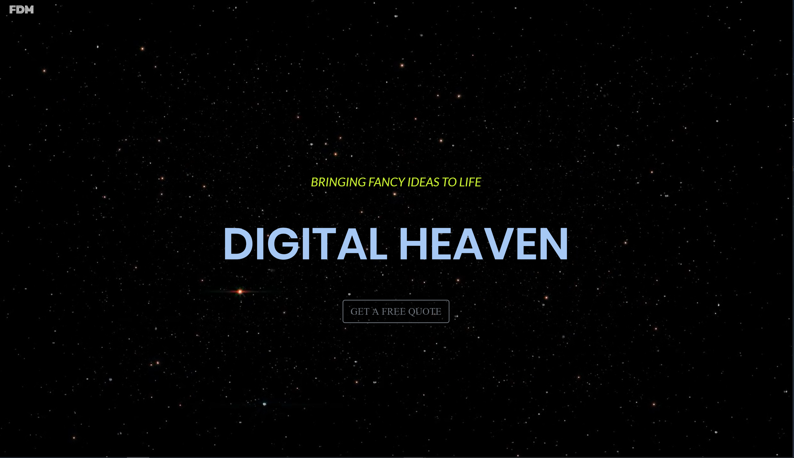

# Bootstrap Portfolio

Live site <https://dee1985.github.io/bootstrap/>

Landing page: 

Description and Usage: Utilizing Bootstrap features (i.e grid layout, components, responsive design, etc...), this site is a mock representation of a landing page and can be used as a template.

Instructions: Resize screen for different viewing options.

Mobile view 

Installation: No installation required.

Contributions: A lot of Google Fu!

Challenges: Familiarizing myslef with Bootstrap and Flexbox. Limiting CSS usage.

Successes: The site is responsive. Video feature added for an interesting user exerpience.

Future Plans: As I am becoming for comfortable with flexbox and Bootstrap, I would redo this assignment with less CSS.
